# Session 16: CI/CD and GitHub Actions

**Name:** Parth Dagia
**Roll No:** 24BCS10414

A complete CI/CD demo: a small Python calculator API that GitHub Actions lints, tests, scans, builds and packages as a Docker image on every push (CI), then publishes to GitHub Container Registry and deploys (CD).

- **GitHub repo (pipelines run here):** <https://github.com/parthdagia05/session16-cicd-github-actions>
- **Actions runs:** <https://github.com/parthdagia05/session16-cicd-github-actions/actions>
- **Docker image:** `ghcr.io/parthdagia05/session16-cicd-github-actions:latest`
- Class material: [session-16-github-actions/10-final-cicd-pipeline](https://github.com/Nency-Ravaliya/devops-heros/tree/main/session-16-github-actions)

GitHub only runs workflows from `.github/workflows/` at the **root** of a repo, so this folder was pushed as its own repository.

---

## Deliverables

| Deliverable | Where |
|---|---|
| Application source code | [app/calculator.py](app/calculator.py), [app/main.py](app/main.py) (Flask API) |
| Tests | [tests/test_calculator.py](tests/test_calculator.py), [tests/test_api.py](tests/test_api.py) (11 tests, 97% coverage) |
| Dockerfile | [Dockerfile](Dockerfile), [.dockerignore](.dockerignore) |
| Build script | [build.sh](build.sh) |
| CI pipeline | [.github/workflows/ci.yml](.github/workflows/ci.yml) |
| CD pipeline | [.github/workflows/cd.yml](.github/workflows/cd.yml) |
| Screenshots of pipeline runs | [screenshots/](screenshots) (19 images, [listed below](#screenshots)) |
| Raw logs | [logs/](logs) (local runs and cleaned GitHub job logs) |

## Project structure

```text
15_CICD_GitHub_Actions/
├── .github/workflows/
│   ├── ci.yml            # CI: lint, test (matrix), security, build, docker smoke test
│   └── cd.yml            # CD: publish image to GHCR, deploy to "production"
├── app/
│   ├── calculator.py     # add / subtract / multiply / divide
│   └── main.py           # Flask API: /, /health, /calc/<op>?a=&b=
├── tests/
│   ├── test_calculator.py
│   └── test_api.py
├── Dockerfile            # python:3.12-slim + gunicorn, non-root user, HEALTHCHECK
├── build.sh              # creates build/ with app + build-info.txt + tar.gz
├── requirements.txt      # runtime: flask, gunicorn
├── requirements-dev.txt  # + pytest, pytest-cov, flake8
├── shot.py               # renders logs into terminal screenshots
├── logs/
└── screenshots/
```

---

## 1. CI vs CD

| | CI (Continuous Integration) | CD (Continuous Delivery / Deployment) |
|---|---|---|
| Question it answers | "Is this change correct?" | "Ship the change that passed CI" |
| When | Every push and every pull request | Only after CI passes on `main` |
| What it does | Lint, test, security check, build, build image | Publish image, deploy, verify deployment |
| Output | Pass/fail + build artifacts | Running app + released image |
| In this project | [ci.yml](.github/workflows/ci.yml) | [cd.yml](.github/workflows/cd.yml) |

*Continuous Delivery* means every good build is ready to release and a human presses the button. *Continuous Deployment* means it goes out automatically. This project does automatic deployment: CD starts on its own when CI succeeds. It also has `workflow_dispatch`, so it can be run by hand.

## 2. The CI/CD pipeline

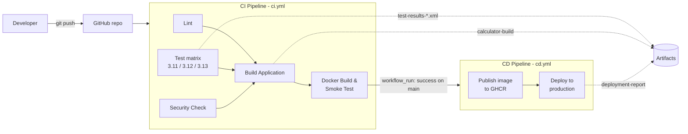

`git push` → **Lint + Test + Security** (parallel) → **Build** → **Docker build + smoke test** → *CI success* → **Publish image** → **Deploy** → **Verify**

If any CI job fails, everything after it is skipped, including the whole CD pipeline ([section 11](#11-failure-scenario)).

## 3. GitHub Actions

GitHub Actions is GitHub's built-in automation platform. You commit YAML files to `.github/workflows/`. GitHub then watches for events (push, pull request, manual trigger, another workflow finishing) and runs the jobs in those files on its own machines.

| Concept | Meaning | Where in this project |
|---|---|---|
| **Workflow** | One YAML file = one automated process | `ci.yml` ("CI Pipeline"), `cd.yml` ("CD Pipeline") |
| **Event / trigger** | What starts a workflow (`on:`) | `push`, `pull_request`, `workflow_dispatch`, `workflow_run` |
| **Job** | A group of steps that runs on one runner | `lint`, `test`, `security-check`, `build`, `docker-build`, `publish`, `deploy` |
| **Step** | One command (`run:`) or one action (`uses:`) inside a job | `Checkout source code`, `Run tests`, ... |
| **Action** | A reusable step published by someone | `actions/checkout@v7`, `actions/setup-python@v7`, `actions/upload-artifact@v7`, `docker/login-action@v4`, `docker/build-push-action@v7` |
| **Runner** | The machine that executes a job | `ubuntu-latest` (GitHub hosted) |
| **Secret** | Encrypted value, masked as `***` in logs | `DEPLOY_TOKEN`, `GITHUB_TOKEN` |
| **Artifact** | File(s) saved from a run that you can download | `test-results-py3.x`, `calculator-build`, `deployment-report` |
| **Environment** | Named deploy target with its own history and protection rules | `production` |

## 4. Workflow

A workflow is a YAML file with a **name**, **triggers** and **jobs**. Here are the triggers from both files:

```yaml
# ci.yml
name: CI Pipeline
on:
  push:
    branches: [main]
  pull_request:
    branches: [main]
  workflow_dispatch:          # "Run workflow" button in the Actions tab

# cd.yml
name: CD Pipeline
on:
  workflow_run:               # start when another workflow finishes
    workflows: ["CI Pipeline"]
    types: [completed]
    branches: [main]
  workflow_dispatch:
```

`workflow_run` is the link between CI and CD. CD starts when "CI Pipeline" completes on `main`, and its first job checks that CI actually succeeded:

```yaml
if: github.event_name == 'workflow_dispatch' || github.event.workflow_run.conclusion == 'success'
```

Both workflows also set the least `GITHUB_TOKEN` permissions they need: `contents: read` for CI, plus `packages: write` for CD so it can push to GHCR.

## 5. Jobs

| Workflow | Job | `needs` | What it does |
|---|---|---|---|
| CI | `lint` | none | `flake8 app tests` |
| CI | `test` | none | pytest + coverage on Python 3.11, 3.12 and 3.13 (matrix = 3 jobs) |
| CI | `security-check` | none | fails if `.env`, `*.pem` or `*.key` files are committed |
| CI | `build` | `lint`, `test`, `security-check` | runs `build.sh`, uploads `calculator-build` artifact |
| CI | `docker-build` | `build` | builds the image, runs it, `curl`s `/health` and `/calc/add` |
| CD | `publish` | none (gated by `if:`) | logs in to GHCR, builds and pushes `:<sha>` and `:latest` |
| CD | `deploy` | `publish` | uses `DEPLOY_TOKEN`, pulls the image, runs it, verifies it, uploads report |

- Jobs with no `needs` run **in parallel**, each on a fresh runner. That's why `lint`, the 3 `test` jobs and `security-check` all start together.
- `needs:` creates the order. `build` waits for all three checks, and a failure in any of them means `build` is **skipped**.
- The **matrix** turns one `test` job definition into 3 jobs:

```yaml
strategy:
  matrix:
    python-version: ["3.11", "3.12", "3.13"]
```

Matrix jobs use `fail-fast: true` by default: when one fails, GitHub cancels the others. The failed run shows this ([screenshot 03](#screenshots)): 3.11 failed, and 3.12 and 3.13 were cancelled.

- Jobs pass data with **outputs**. `publish` sets `image=ghcr.io/...:<sha>` and `deploy` reads it as `needs.publish.outputs.image`.

## 6. Steps

Each step is either a shell command (`run:`) or a reusable action (`uses:`). Steps in one job run in order on the same runner and share its filesystem. Here is the `test` job:

```yaml
steps:
  - name: Checkout source code          # action: clone the repo into the runner
    uses: actions/checkout@v7
  - name: Setup Python                  # action: install Python + cache pip
    uses: actions/setup-python@v7
    with:
      python-version: ${{ matrix.python-version }}
      cache: pip
  - name: Show runner info              # shell
    run: |
      echo "Runner OS:   ${{ runner.os }}"
      echo "Runner arch: ${{ runner.arch }}"
      python --version
  - name: Install dependencies
    run: pip install -r requirements-dev.txt
  - name: Run tests
    run: pytest -v --cov=app --cov-report=term --junitxml=test-results.xml
  - name: Upload test results
    if: always()                        # run even if tests failed
    uses: actions/upload-artifact@v7
```

`if: always()` on the upload step means the test report is saved **even when tests fail**. The failed run still produced 2 artifacts.

## 7. Runners

```yaml
runs-on: ubuntu-latest
```

A **runner** is the machine that executes a job. All jobs here use **GitHub-hosted** runners. For every job GitHub creates a fresh Ubuntu VM (4 CPUs, 16 GB RAM, x64, with Docker preinstalled), runs the steps, then throws the VM away. The "Show runner info" step prints `Runner OS: Linux`, `Runner arch: X64` ([screenshot 09](#screenshots)).

| Runner type | Who manages it | When to use |
|---|---|---|
| GitHub hosted (`ubuntu-latest`, `windows-latest`, `macos-latest`) | GitHub | Default; clean VM each job, free minutes for public repos |
| Self-hosted (`runs-on: self-hosted`) | You | Need special hardware, private network access, or a long-lived cache |

Because each job gets a new VM, nothing is shared between jobs automatically. That's why every job starts with `actions/checkout`, and why files go between jobs or out of the run as **artifacts** or **outputs**.

## 8. Secrets

Secrets are encrypted values stored in the repo settings (**Settings → Secrets and variables → Actions**) and read in workflows as `${{ secrets.NAME }}`. GitHub replaces their value with `***` in all logs.

| Secret | How it was created | Used for |
|---|---|---|
| `GITHUB_TOKEN` | Automatic, one per run, expires when the run ends | Logging in to `ghcr.io` to push and pull the image |
| `DEPLOY_TOKEN` | `openssl rand -hex 16 \| gh secret set DEPLOY_TOKEN` | Stand-in for a real deploy credential (cloud key, kubeconfig, SSH key) |

```yaml
- name: Check deploy secret
  env:
    DEPLOY_TOKEN: ${{ secrets.DEPLOY_TOKEN }}
  run: |
    if [ -z "$DEPLOY_TOKEN" ]; then
      echo "DEPLOY_TOKEN secret is not set"
      exit 1
    fi
    echo "DEPLOY_TOKEN is set (value is masked in logs: $DEPLOY_TOKEN)"
```

The run log shows: `DEPLOY_TOKEN is set (value is masked in logs: ***)` ([screenshot 15](#screenshots)). The step tries to print the secret, but GitHub masks it.

Rules I followed:
- Never commit secrets. `.env` is in [.gitignore](.gitignore) and the `security-check` job fails the build if one is committed.
- Pass secrets through `env:` instead of writing them directly inside a `run:` script.
- Secrets are **not** given to workflows started from forks' pull requests.

## 9. Artifacts

Artifacts are files a job uploads so you can download them after the run, or so a later job can use them.

| Artifact | Job | Contents |
|---|---|---|
| `test-results-py3.11` / `3.12` / `3.13` | `test` | JUnit XML test report |
| `calculator-build` | `build` | `app/`, `Dockerfile`, `requirements.txt`, `build-info.txt`, `calculator-<sha>.tar.gz` |
| `deployment-report` | `deploy` | JSON response of the deployed app's `/` endpoint |

```yaml
- name: Upload build artifact
  uses: actions/upload-artifact@v7
  with:
    name: calculator-build
    path: build/
    retention-days: 7
```

Download one with: `gh run download <run-id> -n calculator-build`

The **Docker image** in GHCR is the real release artifact of the CD pipeline. It's tagged with the short commit SHA (`:39ba203`) so every deploy can be traced to a commit, and also with `:latest` ([screenshot 06](#screenshots)).

## 10. Build and Test

### Test

```bash
python3 -m venv .venv && source .venv/bin/activate
pip install -r requirements-dev.txt
flake8 app tests
pytest -v --cov=app
```

```text
tests/test_api.py::test_index PASSED
tests/test_api.py::test_health PASSED
tests/test_api.py::test_calc_add PASSED
tests/test_api.py::test_calc_divide_by_zero PASSED
tests/test_api.py::test_calc_bad_input PASSED
tests/test_api.py::test_calc_unknown_op PASSED
tests/test_calculator.py::test_add PASSED
tests/test_calculator.py::test_subtract PASSED
tests/test_calculator.py::test_multiply PASSED
tests/test_calculator.py::test_divide PASSED
tests/test_calculator.py::test_divide_by_zero PASSED
TOTAL                  39      1    97%
============================== 11 passed ==============================
```

### Build

```bash
./build.sh                          # -> build/ (artifact contents)
docker build -t calculator:local .
docker run -d -p 5050:5000 calculator:local
curl http://localhost:5050/health   # {"status":"ok","version":"local"}
curl "http://localhost:5050/calc/add?a=10&b=5"
# {"a":10.0,"b":5.0,"operation":"add","result":15.0}
```

Dockerfile notes: `python:3.12-slim` base. `requirements.txt` is copied before `app/` so the pip layer stays cached when only the code changes. The app is served with gunicorn rather than the Flask dev server, runs as a non-root `appuser`, and has a `HEALTHCHECK` (`docker ps` shows `(healthy)`, [screenshot 18](#screenshots)). `APP_VERSION` is passed as a build arg so `/health` reports which commit is running.

Pull and run the image CD published:

```bash
docker run -p 5000:5000 ghcr.io/parthdagia05/session16-cicd-github-actions:latest
```

## 11. Failure scenario

I followed the reference task and broke the app on purpose:

```python
def add(a, b):
    return a + b + 1
```

Locally, `pytest` shows `2 failed, 9 passed` ([screenshot 19](#screenshots)). After pushing:

```text
CI Pipeline  ✗  "Break add() to demo a failing pipeline"
├── ✓ Lint
├── ✓ Security Check
├── ✗ Test (Python 3.11)          assert 16 == 15
├── ⊘ Test (Python 3.12)          cancelled (fail-fast)
├── ⊘ Test (Python 3.13)          cancelled (fail-fast)
├── ⊘ Build Application           skipped (needs: test)
└── ⊘ Docker Build & Smoke Test   skipped (needs: build)

CD Pipeline  ⊘  skipped (CI conclusion != success)
```

The broken code never reached the registry or production. Then I fixed it:

```bash
git commit -am "Fix add()" && git push
```

CI passed, and CD published `:39ba203` and deployed it.

## 12. Pipeline execution

All 8 runs on the repo:

| # | Commit | CI Pipeline | CD Pipeline |
|---|---|---|---|
| 1 | Add CI/CD demo | ✅ success (54s) | ✅ success, deployed `9990b87` |
| 2 | Bump actions to latest major versions | ✅ success (54s) | ✅ success, deployed `77567b4` |
| 3 | Break add() to demo a failing pipeline | ❌ failure (17s) | ⊘ skipped |
| 4 | Fix add() | ✅ success (1m 11s) | ✅ success, deployed `39ba203` |

The first run printed warnings that `upload-artifact@v4`, `login-action@v3` and `build-push-action@v6` still run on the deprecated Node 20. Run 2 bumped them to `upload-artifact@v7`, `checkout@v7`, `login-action@v4` and `build-push-action@v7`, and the warnings went away.

---

## Screenshots

**GitHub Actions UI** (taken from the public repo pages):

| # | Screenshot |
|---|---|
| 01 | All workflow runs: success, failure and skipped<br>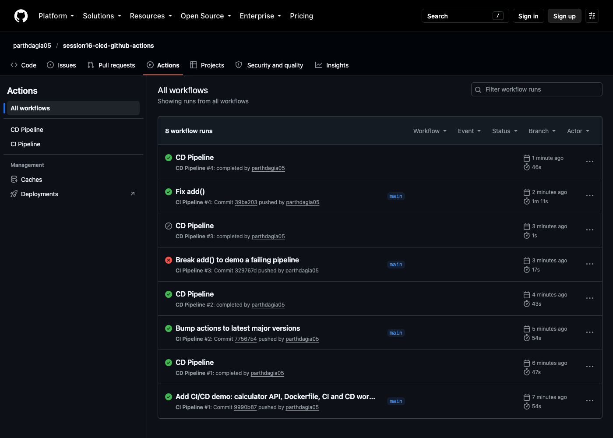 |
| 02 | CI run: job graph (matrix + lint + security → build → docker), all green<br>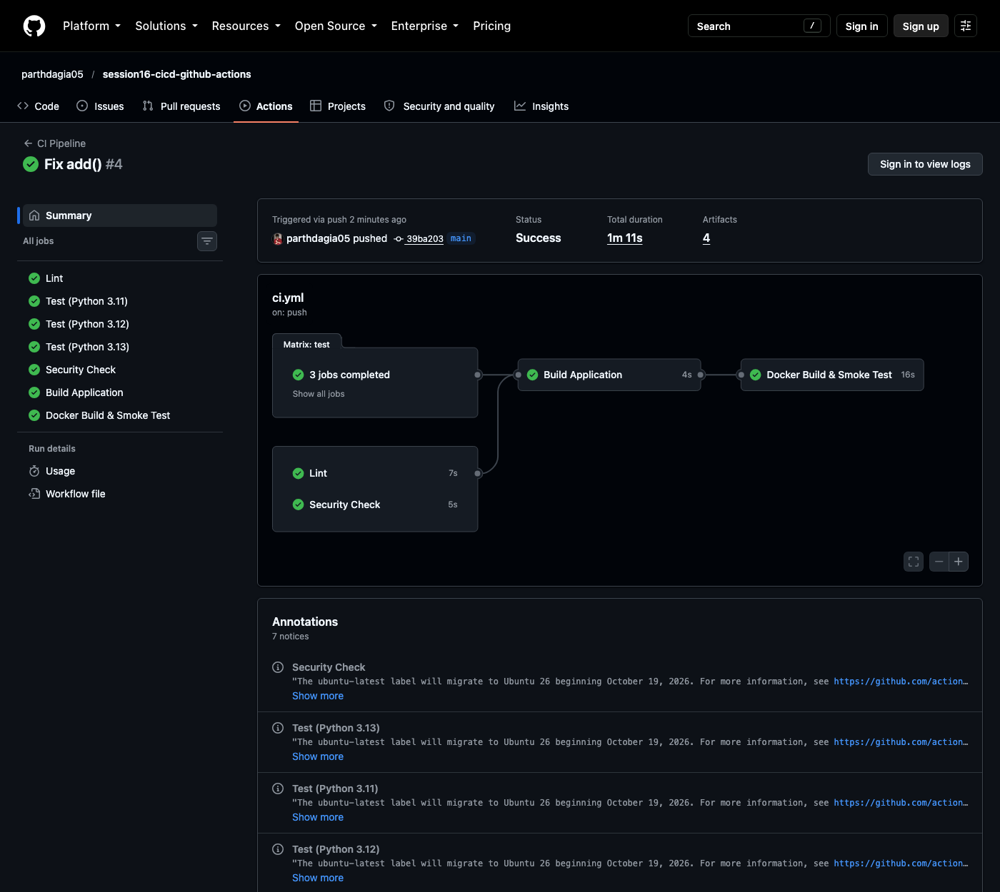 |
| 03 | CI run failing: test fails, matrix siblings cancelled, build skipped<br>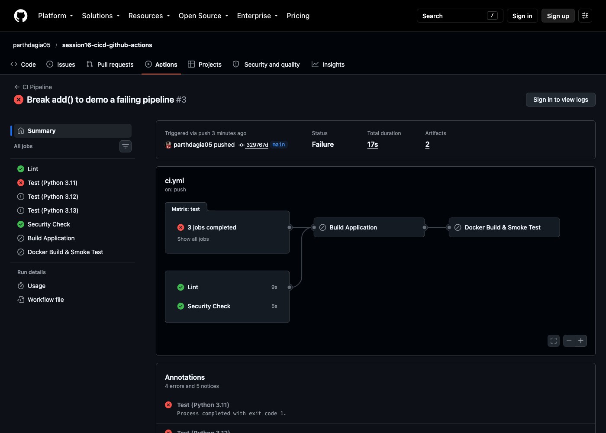 |
| 04 | CD run: publish → deploy, with artifacts<br>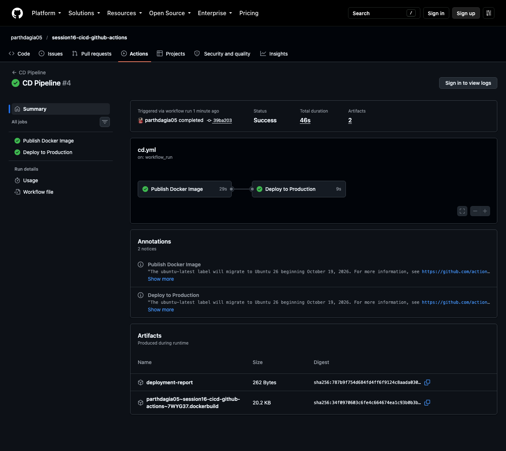 |
| 05 | CD skipped because CI failed<br>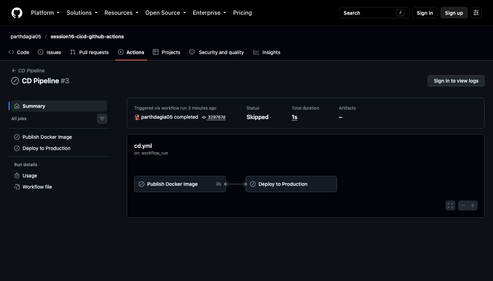 |
| 06 | Image published to GitHub Container Registry<br>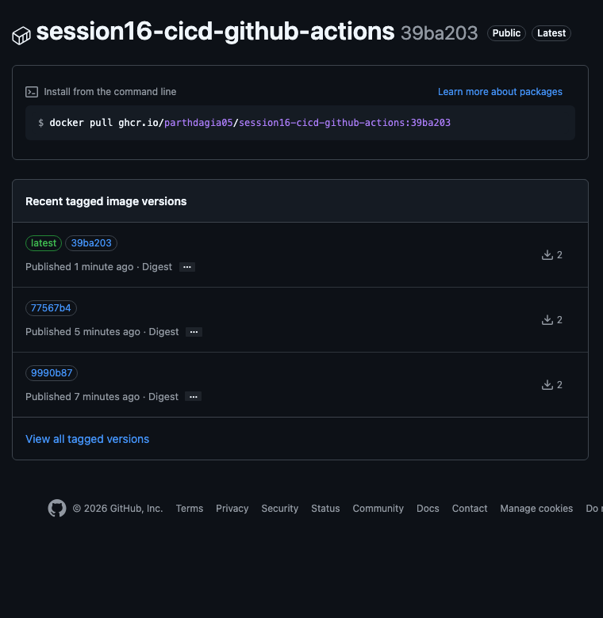 |
| 07 | CI artifacts: build output + test reports<br>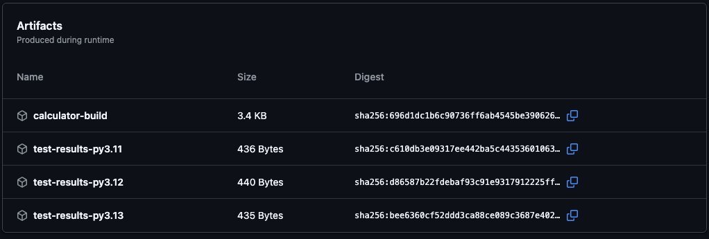 |
| 08 | `production` environment, `DEPLOY_TOKEN` secret, deployment history<br>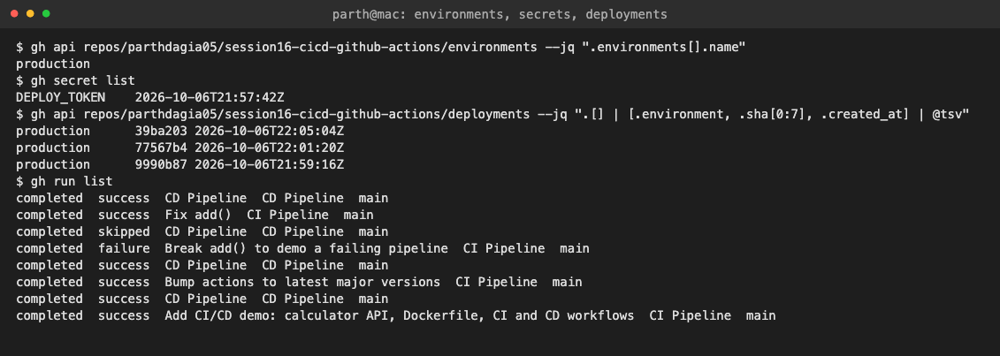 |

**Job logs** (GitHub hides step logs from logged-out visitors, so these are rendered from `gh run view --job <id> --log` with [shot.py](shot.py)):

| # | Screenshot |
|---|---|
| 09 | Test job: runner info, 11 tests passed, coverage, artifact upload<br>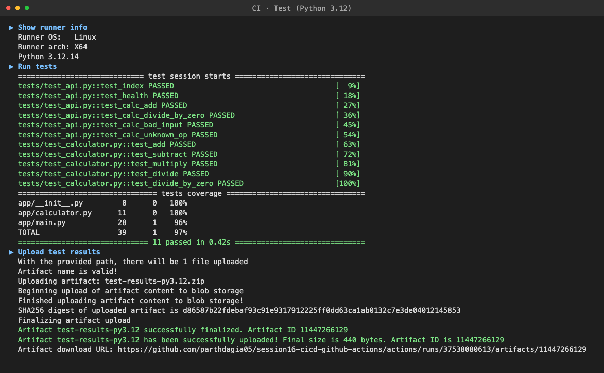 |
| 10 | Security check<br>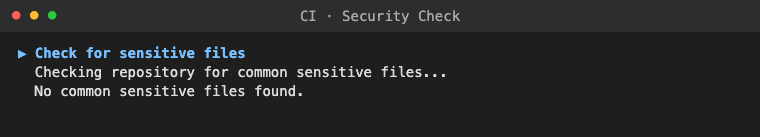 |
| 11 | Build job + `calculator-build` artifact<br>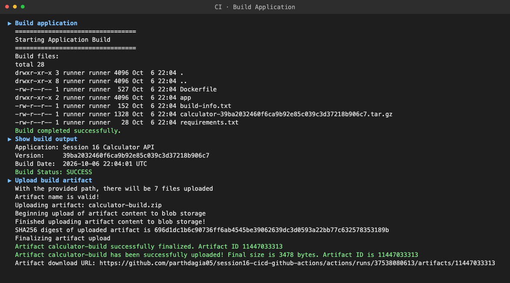 |
| 12 | Docker build + smoke test on the runner<br>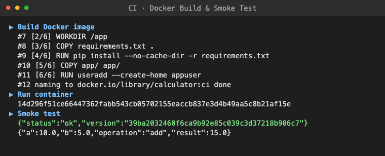 |
| 13 | Failed test job (`assert 16 == 15`)<br>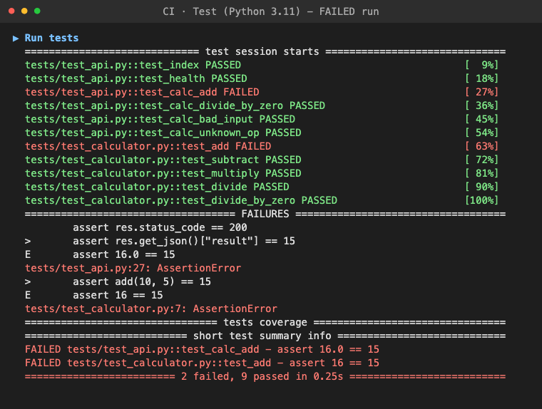 |
| 14 | CD publish: push `:sha` and `:latest` to GHCR<br>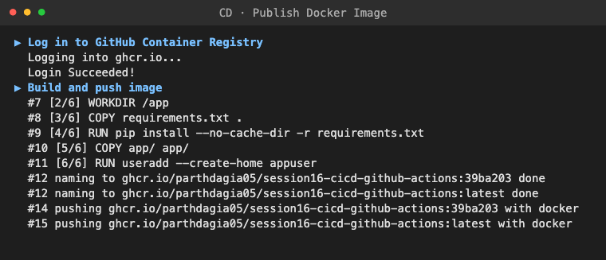 |
| 15 | CD deploy: secret masked as `***`, pull, run, verify, report<br>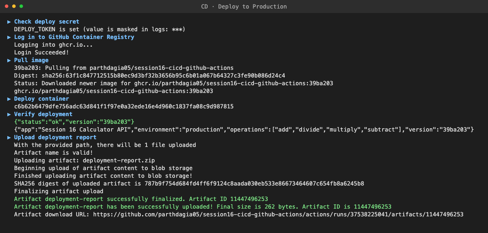 |

**Local run on my Mac:**

| # | Screenshot |
|---|---|
| 16 | flake8 + pytest<br>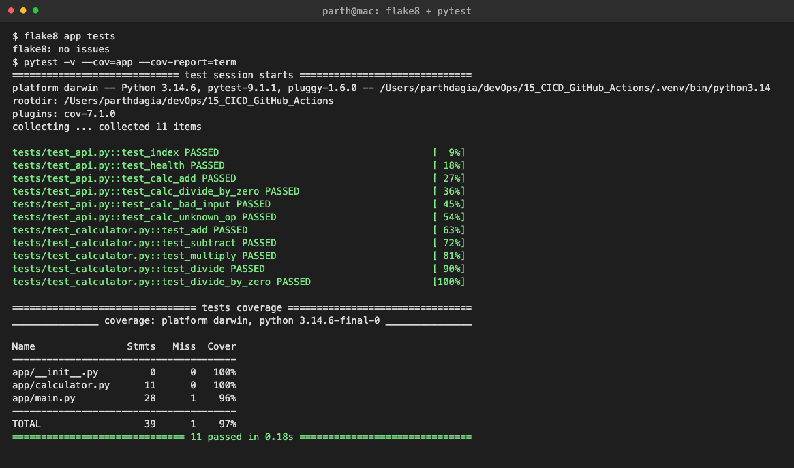 |
| 17 | `./build.sh`<br>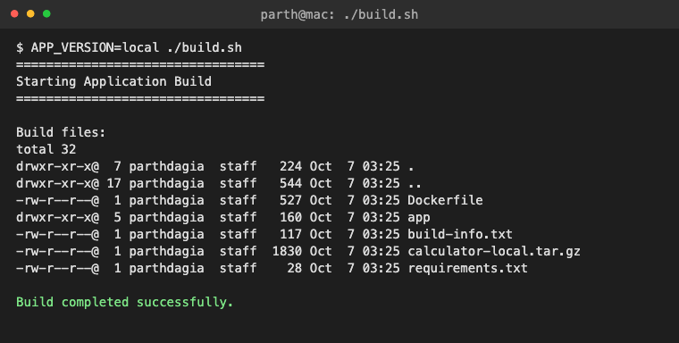 |
| 18 | `docker build` + `docker run` + curl<br>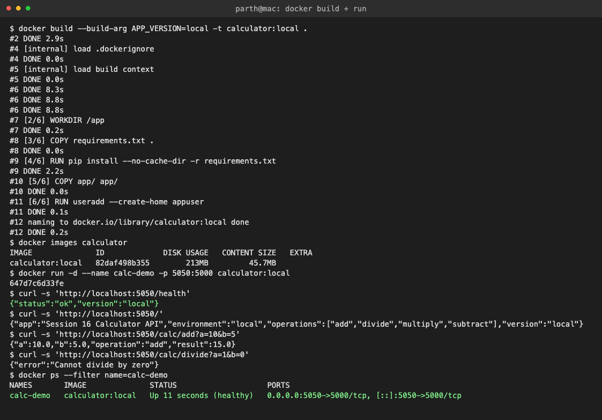 |
| 19 | pytest after breaking `add()`<br>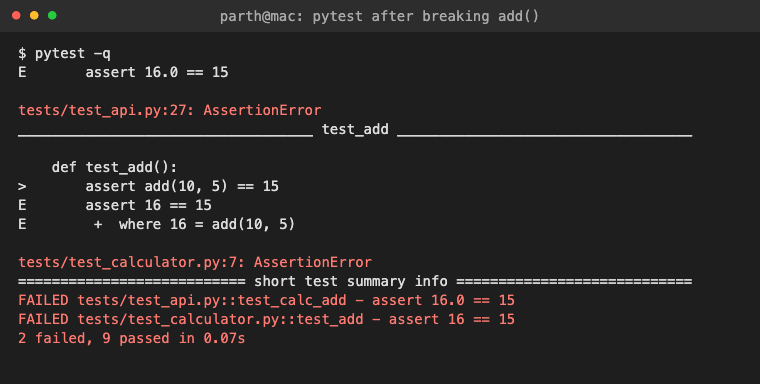 |

---

## Concept map

```text
CI/CD
├── CI  (ci.yml, every push / PR)
│   ├── Lint ───────────┐
│   ├── Test (matrix) ──┼──▶ Build ──▶ Docker build + smoke test
│   └── Security ───────┘      └─ artifact: calculator-build
└── CD  (cd.yml, after CI success on main)
    ├── Publish ──▶ ghcr.io/...:<sha>, :latest     (GITHUB_TOKEN)
    └── Deploy  ──▶ environment: production        (DEPLOY_TOKEN)
                    └─ artifact: deployment-report
```

## Key learnings

1. **CI protects `main`, CD ships it.** Keeping them in separate workflows linked by `workflow_run` means CD can only run on code that passed every CI check.
2. **`needs:` is the safety gate.** A failing test skips build, docker and the whole CD pipeline, so broken code never reaches the registry.
3. **Every job runs on a fresh runner.** Code must be checked out again in each job, and results move through artifacts or job outputs.
4. **Tag images with the commit SHA**, not just `latest`, so you always know exactly what is deployed and can roll back.
5. **Secrets are masked but can still leak** if a step writes them to a file or artifact. Keep them in `env:` and give `GITHUB_TOKEN` only the permissions it needs.
6. **The deploy target here is the runner itself** (the container runs, is verified, then the VM is thrown away). For a real deployment, swap the "Deploy container" step for `kubectl`/`helm upgrade` (sessions 8–15), SSH to a server, or a cloud deploy action. Nothing else in the pipeline needs to change.
